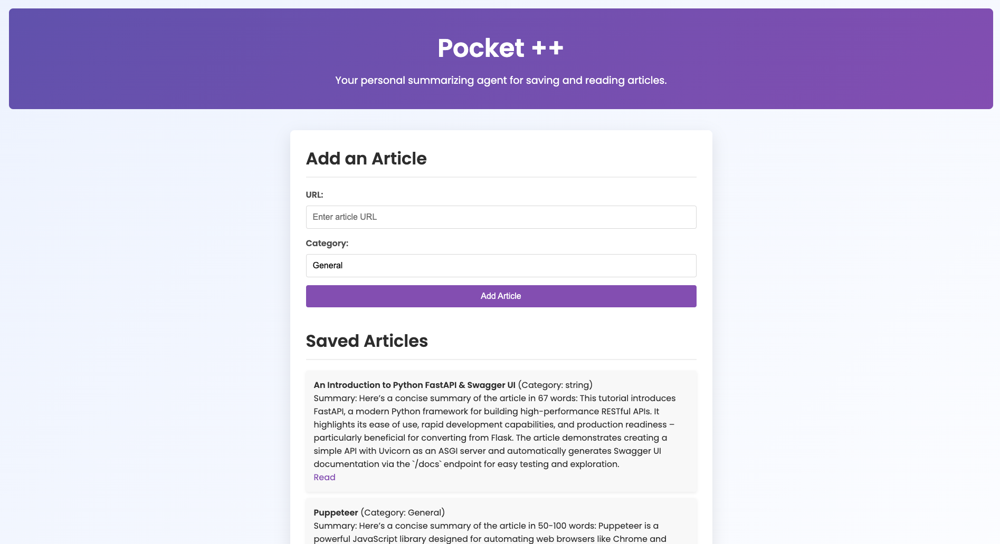

# Pocket ++

### your personal article Saver

A personal summarizing agent that scrapes articles, summarizes them, and saves them locally.



## Prerequisites

- Python 3.8+
- (Optional) LMStudio running locally at `http://localhost:1234` for summarization (falls back to basic summary if unavailable).

## Setup

1. Clone the repository:

   ```
   git clone https://github.com/yourusername/articlesaver.git
   cd articlesaver
   ```

2. Create a virtual environment:

   ```
   python -m venv venv
   source venv/bin/activate  # On Windows, use: venv\Scripts\activate
   ```

3. Install the dependencies:
   ```
   pip install -r requirements.txt
   ```

## Usage

### Running the CLI

To use the CLI for adding, listing, or reading articles:

```
python src/pocketpp/app.py add <article_url> --category <category_name>
python src/pocketpp/app.py list
python src/pocketpp/app.py read <article_id>
```

### Running the FastAPI Backend

To start the FastAPI backend:

```
uvicorn src.pocketpp.api:app --reload
```

Access the API documentation at `http://127.0.0.1:8000/docs`.

### Example API Endpoints

- **Add an Article**: `POST /articles/`
- **List Articles**: `GET /articles/`
- **Read an Article**: `GET /articles/{article_id}/read`

## Development

### Setting up the development environment

1. Clone the repository:

   ```
   git clone https://github.com/yourusername/articlesaver.git
   cd articlesaver
   ```

2. Create and activate a virtual environment:

   ```
   python -m venv venv
   source venv/bin/activate  # On Windows, use: venv\Scripts\activate
   ```

3. Install development dependencies:
   ```
   pip install -e ".[dev]"
   ```

## Contributing

Contributions are welcome! Please feel free to submit a Pull Request.

## License

This project is licensed under the MIT License - see the LICENSE file for details.
